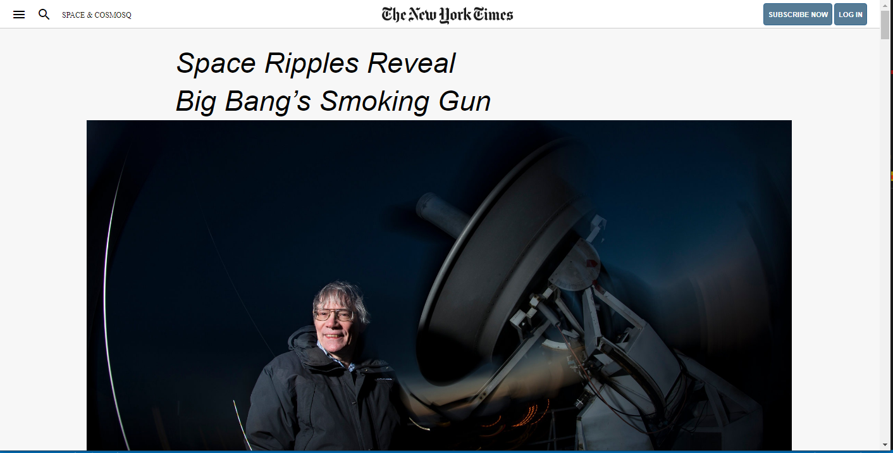

# HTML forms

> This HTML document is a clone of a New York Times [article page](https://www.nytimes.com/2014/03/18/science/space/detection-of-waves-in-space-buttresses-landmark-theory-of-big-bang.html?_r=0) 

## Built With

- HTML
- CSS
- CSS Flexbox
- CSS Grid
- Float

## Live Demo

[Live Demo Link]( https://emmanuelaaron.github.io/postioning_and_floating_elements/)

## Getting Started
Clone this repo on your local machine

### Prerequisites
To make this repository working in your local machine you need only a browser.

## Authors

👤 **Emmanuel Isabirye**

- Github: [@EmmanuelAaron](https://github.com/Emmanuelaaron)
- Twitter: [@EmmanuelAaron](https://twitter.com/EmmanuelIsabir1)
- Linkedin: [@EmmanuelAaron](https://www.linkedin.com/in/fullstackwebdev-emma/)

👤 **Marcos Hernández Campos**

- Github: [@marcoshdezcam](https://github.com/marcoshdezcam)
- Twitter: [@MarcosHCampos](https://twitter.com/MarcosHCampos)
- Linkedin: [Marcos Hernández](https://linkedin.com/marcos-hernández-56058119a/)

## 🤝 Contributing

Contributions, issues and feature requests are welcome!

Feel free to check the [issues page](https://github.com/Emmanuelaaron/postioning_and_floating_elements/issues).

## Show your support

Give a ⭐️ if you like this project!

## Acknowledgments

- Great Thanks to [Marcos Hernandez](https://github.com/marcoshdezcam) for the support given during the execution of this project

## 📝 License

This project is [MIT](lic.url) licensed.
